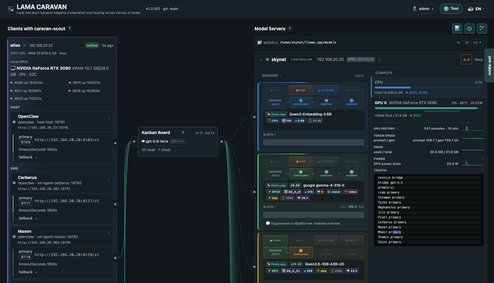
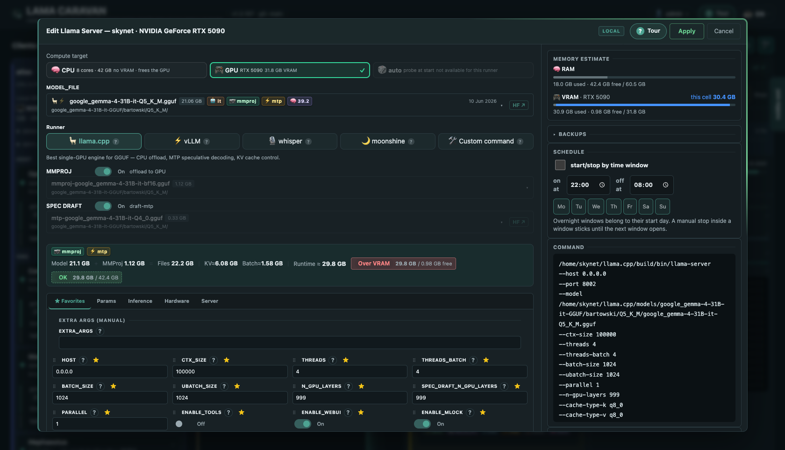
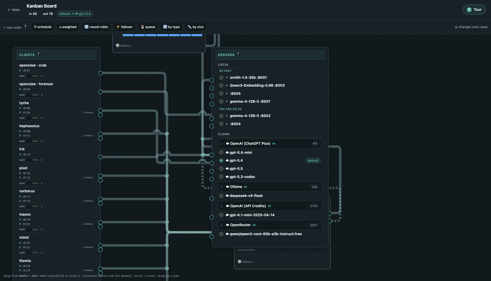
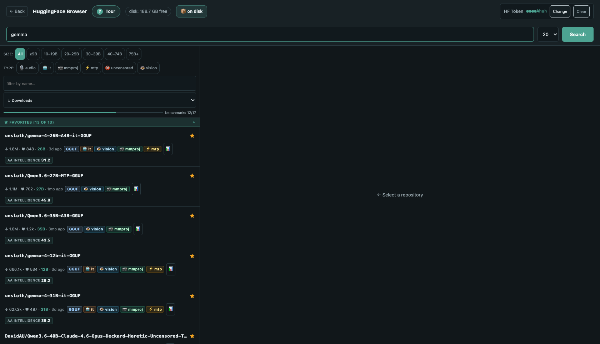

# LAMA CARAVAN

**L**ocal **A**nd **M**ulti-backend **A**daptive **C**omputation **A**nd **R**outing **A**cross **V**arious **A**I **N**odes.

Repository/service slug: `lama-caravan`.

Local control plane for LAMA CARAVAN: controller topology, proxy routing, and
per-host `llama.cpp` server cells.

The app is intentionally dependency-light: it uses Python standard library
HTTP handling and static HTML/CSS/JS.

## Why LAMA CARAVAN

The problem it solves: you have AI agents (OpenClaw, Hermes, anything speaking
the OpenAI API) burning tokens all day, a couple of machines with GPUs standing
mostly idle, and cloud subscriptions that are metered, rate-limited and see
your prompts. LAMA CARAVAN glues that into one system where **tokens are
processed wherever it makes sense right now** — locally when your hardware can
take it, in the cloud when it can't.

What that gives you in practice:

- **Stable endpoints for agents.** Every agent points at its own fixed proxy
  port on the controller — and never needs reconfiguring again. Swap the model,
  move it to another machine, reroute to the cloud: the agent doesn't notice.
- **Bridge ports: cloud models for ANY app, not just agents.** One click on a
  cloud provider's card opens an OpenAI-compatible port pinned to a chosen
  model — the caravan holds the keys/OAuth, meters the spend and logs the
  requests. Point a transcription tool, a translator overlay or an IDE plugin
  at `http://controller:port` and it speaks to `gpt-…`/OpenRouter/Anthropic
  without owning a single credential.
- **Local ⇄ cloud routing you can draw.** Each port has a visual pipeline (the
  kanban): queue nodes with priorities and admission limits, **schedule nodes**
  (nights on the big GPU, work hours to the cloud), weighted splits,
  round-robin, failover/spill when a server is busy or down, request-size
  forks (small prompts → small local model, huge contexts → cloud), content
  rules. Changes hot-reload in ~2 s, no restarts.
- **Queues instead of timeouts.** One GPU shared by five agents stops being a
  free-for-all: requests line up with priorities and per-route limits instead
  of stepping on each other.
- **Money and privacy.** Local tokens cost electricity; the cloud is used only
  where you routed it. Usage & spend statistics show tokens/requests/costs per
  agent and per backend, so the routing pays for itself visibly. Sensitive
  agents can be pinned to local-only routes — those prompts never leave the LAN.
- **Your whole zoo of hardware as one fleet — client GPUs included.** The
  [caravan-scout](https://github.com/thepr0metheus/caravan-scout) sidecar turns
  any Linux/macOS box into a fleet member: its GPUs and running agents appear
  on the board, and you launch cells there remotely — **any of the five
  runners, on the client's own GPU or CPU**, models cached and shipped from
  the controller. Before starting you see a "will it fit" estimate against
  BOTH pools (RAM and VRAM) of that exact host; a running cell shows what it
  *actually* holds, measured per-process from `nvidia-smi` — on the
  controller and on clients alike.
- **Five runners, one lifecycle.** A cell is not just llama.cpp — pick the
  engine per cell, and they all share the same cards, health checks,
  start/stop/schedule machinery and memory math:
  - 🦙 **llama.cpp** — GGUF, CPU offload, MTP speculative decoding, KV-cache control
  - ⚡ **vLLM** — safetensors (AWQ/GPTQ everywhere, NVFP4/FP8 on new GPUs),
    continuous batching; provisioned into its own venv on first start, with
    pinned version + one-click update/rollback
  - 🎙️ **whisper** — speech-to-text (faster-whisper); the model downloads
    itself, language is picked per request
  - 🌙 **moonshine** — CPU-only speech-to-text (Moonshine v2) that beats
    Whisper large-v3 accuracy on English at 250M params — GPUs stay free for LLMs
  - 🛠️ **Custom command** — any process that listens on `$PORT` becomes a
    managed cell: health-checked, logged, scheduled, restarted
- **One compute-target switch.** Every cell picks **CPU / GPU / auto** with one
  control (options a runner can't do are disabled); a multi-GPU host fans out
  into per-card chips or a checklist, and llama.cpp gets the right
  device/split/threads flags written for it.
- **Models from HuggingFace in two clicks.** The built-in HF browser searches
  GGUF repos, shows quants with sizes and benchmark badges, downloads
  multi-part files straight into the controller's model directory.
- **You see everything.** A live topology board (cables light up with real
  traffic), per-request history with timings and error kinds, incident badges,
  GPU/CPU/token-speed monitors.
- **Nothing to install but Python.** Controller and agent are stdlib-only; no
  database server, no external services, Docker optional (see the quick start).
  State lives in plain JSON files (hot-reloadable, git-diffable, backed up by
  copying) plus one small embedded SQLite file for accounts/sessions — and
  systemd/launchd units on your own machines.

A concrete day with it: your coding agents hammer a local Qwen on the desktop
GPU all night on a schedule window; in the morning the schedule flips them to
a subscription provider while the GPU serves a bigger model for a research
agent; one agent with confidential data stays pinned to the local route; a
whisper cell transcribes on a spare box; and the spend chart shows what all of
that would have cost in cloud tokens.

The long version of that day — with the kanban that implements it — lives in
[docs/day-with-the-caravan.md](docs/day-with-the-caravan.md).

## Quick start (Docker)

> **Docker is the evaluation path** — the fastest way to look around: one
> container with the admin UI and the proxy router, no models inside. The
> **primary, fully-featured deployment is the native systemd install**
> ([Install On the controller](#install-on-the-controller)) — it also runs
> `lama-cell@<port>` server cells on the controller box itself, with journald
> logs, restart limits and per-cell memory caps.

```bash
git clone https://github.com/thepr0metheus/lama-caravan.git
cd lama-caravan
LLAMA_TOPOLOGY_SERVER_IP=<this-machine-LAN-IP> docker compose up -d --build
# open http://<this-machine>:8090
```

Models are **not** served from inside the container (it has no systemd and, by
design, no GPU): attach each GPU machine — including the Docker host itself —
with [caravan-scout](https://github.com/thepr0metheus/caravan-scout), and its
cells appear on the board. The `?` tour and System → Security (fleet token)
walk you through pairing. All state lives in the `caravan-data` volume
(`/data`): config, accounts, token history, logs and downloaded models.

Notes:

- **Linux host recommended.** `network_mode: host` lets the proxy bind its
  per-agent ports on the fly; on Docker Desktop (macOS/Windows) enable its
  host-networking option or use the native install below.
- Liked it? For day-to-day fleet duty switch to the native install — the
  container is also fine long-term for a GPU-less controller box (NAS/VPS)
  where every model lives on scout hosts.
- Version chip: build with
  `CARAVAN_GIT_HEAD=$(git rev-parse --short HEAD) docker compose up -d --build`.

## Models directory layout

`/hf` downloads land as `<model-name>/<author>/<quant>/<file>.gguf`, e.g.
`gemma-4-12B-it-GGUF/bartowski/Q8_0/gemma-4-12B-it-Q8_0.gguf`. When adding
models by hand, any subfolder under the models dir is scanned — but following
the same layout keeps the model pickers, the disk-cleanup modal and
multi-part grouping tidy (parts `…-00001-of-00004.gguf` belong together).

## Screenshots

The live topology board — clients on the left, kanban routing in the middle,
server cells and GPU telemetry on the right:



The cell editor: the five-runner row (llama.cpp / vLLM / whisper / moonshine /
custom), the CPU/GPU/auto compute target, memory math against BOTH pools — with
the measured live usage of the running cell — every flag explained, and the
exact command it will run. A running cell's window wears the same animated
border comet as its card on the board:



The routing kanban — the development fleet, live: twelve agents on the left,
backup and queue rule nodes in the middle (schedule, weighted, round-robin,
failover, by-type and by-size are one click away in the palette), local cells
and cloud models as outputs. The dashed run is the queue's overflow spilling to
a cloud model:



The built-in HuggingFace GGUF browser:



## Requirements

| Component | Requirement |
|---|---|
| Controller OS | **Primary:** Linux with systemd (tested on Ubuntu 24.04; any systemd distro should work). **Evaluation:** any Docker host via the [Docker quick start](#quick-start-docker) — controller-only, cells then live on scout hosts |
| Python | **3.10+**, standard library only — no pip packages (tested on 3.12) |
| llama.cpp | a `llama-server` build **b400+** (needs `--chat-template-file`; see [Tested versions](#tested-versions)) |
| GPU serving | NVIDIA driver + `nvidia-smi` for telemetry; CUDA build of llama.cpp (CPU-only also works) |
| Client hosts | Linux (systemd --user) or macOS (launchd), Python 3.10+, [caravan-scout](https://github.com/thepr0metheus/caravan-scout) |
| Browser | any modern browser — native ES modules, no build step |
| Storage | plain JSON files + an embedded SQLite file (accounts/sessions); no database server required |

## Tested versions

The exact versions the development fleet runs — re-verified and updated here
whenever a component is upgraded (last verified: **2026-07-19**):

| Component | Verified version |
|---|---|
| llama.cpp | release `b9947` (commit `3de7dd4c8`, built 2026-07-10), CUDA build — controller cells verified live; the Linux client converged onto the same commit via the fleet update button |
| CUDA toolkit | 12.6 |
| NVIDIA driver | 595.71 (controller), 580.159 (client) |
| GPUs | RTX 5090 (Blackwell `sm_120`), RTX 3090 (`sm_86`) |
| OS | Ubuntu 24.04.4 LTS (controller + Linux client), macOS 26.5 (Mac client) |
| Python | 3.12.3 (controller, Linux client); the macOS scout runs on stock 3.9.6 |
| systemd | 255 (Ubuntu 24.04) |
| Docker (container mode) | 29.1 |
| faster-whisper | 1.2.1 (CTranslate2 4.8.0) — whisper command cells |
| vLLM | 0.24.0, pinned provisioning — controller cell `:8012` |
| caravan-scout | v1.2.6 |
| moonshine-voice | 0.0.69 — moonshine STT command cells (CPU-only) |

> The build number `llama-server --version` prints counts commits in the *local
> clone* — a shallow clone undercounts vs upstream `bNNNN` tags, so the commit
> hash is what identifies the build (the topology UI compares commits for the
> same reason). The vLLM runner provisions PINNED (`VLLM_DEFAULT_VERSION`,
> currently 0.24.0; `VLLM_VERSION` env overrides) and is updated/rolled back
> from System → llama.cpp — pip installs are versioned by PyPI itself, so no
> local snapshots are needed.
>
> Field note (2026-07-10): during the `b9947` rollout, `llama_decode` crashed
> with `CUDA error: invalid argument` on the MoE + MTP model — root cause was
> NOT the release but a **stale build dir**: it had been *configured* under
> CUDA 12.6 and incrementally rebuilt with nvcc 13.2, mixing objects with
> different `cudaDeviceProp` layouts (the same franken-build that caused the
> June smpbo incident). `install-llama.sh` now wipes `build/` automatically
> when the cached compiler version doesn't match the live `nvcc`. Two lessons:
> pin a `bNNNN` tag and verify one cell before restarting the rest, and never
> trust an incremental CUDA build across toolkit upgrades.

## Documentation

| Doc | Covers |
|---|---|
| [docs/architecture.md](docs/architecture.md) | Components, data flow, the file contract between the daemons, deployment topology |
| [docs/backend-admin.md](docs/backend-admin.md) | `caravan/admin/` module reference (the admin server) |
| [docs/backend-proxy.md](docs/backend-proxy.md) | `caravan/proxy/` module reference + the request lifecycle |
| [docs/frontend.md](docs/frontend.md) | `static/js/` ES-module reference, state model, render/polling pipeline |
| [docs/http-api.md](docs/http-api.md) | Every HTTP endpoint of the admin and the proxy surface |
| [docs/operations.md](docs/operations.md) | Runbook: services, deploy, rollback, backups, local dev, quirks |
| [docs/day-with-the-caravan.md](docs/day-with-the-caravan.md) | A worked example: one day of hybrid local/cloud routing and the kanban behind it |
| [docs/security.md](docs/security.md) | Accounts/sessions (SQLite), the fleet token for scouts, what stays open |

Legacy single-server mode edits the marked config block in:

```text
~/llama.cpp/start-server.sh
```

The long-term server-cell path uses generated launch artifacts instead:

```text
<project>/var/server-cells/<port>/cell.json
<project>/var/server-cells/<port>/start.sh
```

The structured cell config is the source of truth; `start.sh` is the runnable
artifact used by `lama-cell@<port>.service`.

## Runtime Layout

On the controller the admin service is `lama-caravan.service`; the legacy single
managed llama.cpp server remains `llamacpp-current.service` while server cells
move toward per-port launch scripts.

```text
~/.config/systemd/user/llamacpp-current.service
  -> ~/llama.cpp/start-server.sh
     -> ~/llama.cpp/build/bin/llama-server

~/.config/systemd/user/lama-caravan.service
  -> ~/lama-caravan/.venv/bin/python app.py

~/.config/systemd/user/lama-cell@8001.service
  -> ~/lama-caravan/var/server-cells/8001/start.sh
```

For boot-time autostart without waiting for an interactive SSH or
desktop session, enable linger for your user and install the user
services. Do not also keep a crontab `@reboot` launcher for this admin: two
launchers will fight for port `8090`.

```text
loginctl enable-linger $USER
```

Default URL:

```text
http://<controller-ip>:8090
```

## Code Layout

`app.py` and `agent-proxies.py` are thin launchers (systemd entry points and
the load target for `scripts/test_queue_node.py`); the code lives in the
`caravan/` package:

```text
caravan/
├── common/   shared stdlib helpers: errors, procs, fsio (atomic writes),
│             fetch, jsonx, ttl_cache
├── admin/    the admin server (app.py): paths, state, config_builder, launch,
│             models, systemd_ctl, llama_metrics, hf, downloads, benchmarks,
│             terminal, router_dsl, proxies_config, cloud, token_history,
│             proxy_stats, monitoring, openclaw, oauth, cloud_api, pricing,
│             telemetry, server_cells, fleet_clients, topology, proxy_ops,
│             backups, status, cell_ops, routes (HTTP tables + Handler), main
└── proxy/    the proxy daemon (agent-proxies.py): paths, runtime (shared
              mutable state), config, events, capacity, graph (router DAG),
              state, cloud_auth, translate, summarize, queue_admission,
              handler, listeners, main
```

Import layering is strict and cycle-free: `common` ← `paths` ← `state` ←
domain modules ← aggregators (`topology`, `status`) ← ops/`routes` ← `main`.
Rebindable module globals live in the same module as every function that
rebinds them.

## Deployment Rule

Source changes are deployed through git only:

```text
local commit -> push to your remote -> git pull on the controller/client hosts
```

Do not deploy project code by direct `scp` or hand-copying files, except for an
explicit emergency recovery. Generated runtime files under `var/` are local host
state and are not the source deployment path.

## Features

**Cells & runners**

- Five runners per cell — 🦙 llama.cpp, ⚡ vLLM, 🎙️ whisper, 🌙 moonshine,
  🛠️ custom command — same lifecycle, health checks and cards for all of them.
- One CPU/GPU/auto compute-target control for every runner; unavailable options
  are disabled per engine. A multi-GPU host picks cards with chips (or a
  checklist beyond four), and llama.cpp gets the matching
  device/split/threads flags written for it.
- Memory estimate against BOTH pools (RAM and VRAM) of the target host; a
  running cell shows its **measured** usage (per-process `nvidia-smi`) carved
  out of the used bar instead of a double-counted estimate.
- Cells run on the controller or on any scout host — client GPUs and CPUs are
  first-class; models are cached and shipped from the controller.
- Reserve globally numbered cells from port `8001`; generated `cell.json` +
  `start.sh` artifacts; `systemd --user` template units
  (`lama-cell@<port>.service`) on the controller, scout-managed processes on
  clients (they survive scout restarts).
- Per-cell schedule windows (start/stop by time of day and weekday), autostart,
  a port picker with a fleet-wide grid, and port swap between stopped cells.
- llama.cpp lifecycle: fleet-wide update button, build archive with informed
  one-click restore, a sticky crash watchdog with a server-dismissed banner,
  and a franken-build guard (stale CUDA build dirs are wiped automatically).
- vLLM lifecycle: pinned provisioning into its own venv on first start,
  update/rollback driven by pip's own version history.
- A running cell is ringed by an animated border comet — on its board card AND
  around its config window, colored by compute target (CPU cells blue).

**Routing & proxies**

- Stable per-agent proxy ports; the visual kanban with schedule, weighted,
  round-robin, failover, queue (admission %, sticky-slot reserve, live queue
  panel with history), request-type and request-size forks.
- 🛟 **backup node**: when the main upstream fails before the first byte, the
  request is replayed down the backup output — and the Request History marks
  rescued requests with the failover trail.
- Bridge ports: one click on a cloud provider's card opens an
  OpenAI-compatible port pinned to a chosen model, with honest `/health`.
- Route truth-telling: a route is *confirmed* by the agent's own report or by
  real traffic in the proxy log, *inactive* when the agent says it stopped
  using it, and *unverified* when nothing can vouch for it — three visually
  distinct states, so silence never masquerades as health.
- Cables on the board and kanban fan into parallel lanes instead of piling
  into one trunk; a cable that cannot be drawn says so in the console instead
  of vanishing.

**Observability**

- Live topology board: cables light with real traffic, per-output activity,
  GPU/CPU/RAM bars per host, token-speed and power charts, incident badges.
- Request History with per-request timings, stream stats, error kinds, rescue
  badges; request-log diagnostics API
  (`/api/agent-proxy-logs?port=&errors=1&slim=1`) for debugging routes without
  ssh.
- Usage & spend statistics per agent and per backend; `/metrics` for
  Prometheus (clients, cells, GPU, routes).
- System page: controller services, cells, git/python versions, models-disk
  usage with a cleanup modal; a models page for the library on disk.

**Platform**

- Web UI in **20 languages** with a CI guard that keeps every key translated.
- Optional sign-in: SQLite accounts + sessions, a fleet token for the scouts
  (open by default for homelab use — see [docs/security.md](docs/security.md)).
- Built-in onboarding tours (the floating `?` button) on the board, the kanban
  and the HF browser; with the editor open the same button explains every
  llama.cpp config field.
- Light, dark, and black LLM-focused themes.
- Docker controller-only mode for evaluation; stdlib-only Python everywhere.

**Legacy single-server mode** (still maintained): status/PID/uptime of
`llamacpp-current.service`, the `BEGIN LLAMA CONFIG` block editor with
timestamped backups and revert, journal logs, `/v1/models`-`/props`-`/metrics`
summaries, and the Gemma 4 MTP/vision mode buttons.

## Gemma 4 MTP Text Boost

Gemma 4 can use a small `gemma4_assistant` GGUF as an MTP/speculative draft
head. On the controller this is configured as a text-generation boost for the existing
Gemma 4 model route:

```text
MODEL_FILE="gemma-4-31b-it/q4-k-m/google_gemma-4-31B-it-Q4_K_M.gguf"
SPEC_DRAFT_MODEL_FILE="gemma-4-31b-it/assistant/gemma-4-31B-it-assistant.Q4_K_M.gguf"
SPEC_TYPE="mtp"
SPEC_DRAFT_BLOCK_SIZE="3"
```

When these fields are set and `MODEL_FILE` contains `gemma-4`, the launcher uses
the AtomicChat `atomic-llama-cpp-turboquant` runtime and starts `llama-server`
with:

```text
--mtp-head <assistant.gguf> --spec-type mtp --draft-block-size 3
```

For non-Gemma-4 models the draft setting is ignored, so Qwen and other models
continue to use the normal llama.cpp runtime. If `MMPROJ_FILE` is set, the
server can run vision, but MTP does not accelerate those multimodal slots.

The Config panel has two Gemma 4 mode buttons:

- `Gemma Text MTP` clears `MMPROJ_FILE`, keeps the assistant draft head enabled,
  saves the config, and restarts `llamacpp-current.service`.
- `Gemma Vision` selects the Gemma 4 projector, keeps the same model route,
  saves the config, and restarts `llamacpp-current.service`.

Agents keep using the same `http://<controller-ip>:8080/v1` endpoint. Text-only
Gemma 4 requests get the MTP boost automatically while the text mode is active;
image requests need the vision mode. The Runtime panel shows `Speculative: MTP
text boost` for the boosted mode and `Speculative: MTP paused by vision` when
the projector is enabled. The llama.cpp response timings also expose draft
counters such as `draft_n` and `draft_n_accepted`, and logs include
`statistics mtp`.

## Model licences

The caravan is MIT, but **the models and engines it runs are not** — and their
terms follow the weights, not this repository. Nothing here re-licenses them,
so check what a cell actually runs before putting it in front of paying users:

| what a cell runs | licence |
|---|---|
| llama.cpp, faster-whisper, CTranslate2, F5-TTS *(code)* | MIT |
| vLLM, CosyVoice2 | Apache-2.0 |
| coqui-tts *(the XTTS engine's code)* | MPL-2.0 |
| Moonshine EN model | MIT |
| Moonshine non-EN models | Moonshine Community Licence — free under $1M/yr revenue, registration + attribution |
| **XTTS-v2 model** | **Coqui Public Model Licence — non-commercial** |
| **F5-TTS base model** | **trained on CC-BY-NC data — non-commercial in practice** |
| GGUF models you download | whatever their publisher says (Llama, Qwen and Gemma each differ) |

The two rows in bold are the ones that surprise people: the *engine* is open
source while the *weights* it loads are not free for commercial use. The engine
picker in the cell editor repeats this next to each choice, because a dropdown
is where the decision actually gets made. CosyVoice2 is the voice-clone engine
without that restriction.

## Safety Model

The app only rewrites lines between:

```bash
# BEGIN LLAMA CONFIG
# END LLAMA CONFIG
```

Before saving, it creates:

```text
~/llama.cpp/start-server.sh.bak.YYYYMMDD-HHMMSS
```

It does not delete models or old profiles.

## API

The full endpoint reference (the admin surface and the proxy surface) lives in
[docs/http-api.md](docs/http-api.md). A few that matter most:

- `GET /api/state` — dashboard state, parsed config, models, health, logs.
- `GET /api/topology` — the whole board: hosts, GPUs, cells, proxy routes,
  routers, clients, assignments.
- `GET /api/agent-proxy-logs?port=&errors=1&slim=1` — per-request diagnostics
  for a route (timings, error kinds) without touching ssh.
- `POST /api/topology/client-heartbeat` — heartbeat receiver for
  `caravan-scout` on client hosts.
- `POST /api/topology/assignments` — store desired `agent -> proxy` routes and
  push them to the client's scout.
- `GET /metrics` — Prometheus metrics: clients, cells, GPU, routes.

## Topology GUI

The web UI has two views:

- `Topology` — the main view: the live board with clients, agents and their
  proxy routes, the kanban card, server cells with lifecycle controls, GPU
  telemetry, and the per-request traffic panel.
- `Classic` — the legacy single-server editor and monitor (kept for the
  `llamacpp-current.service` path).

Topology state is stored in the admin state file:

```text
~/.local/state/llamacpp-easy-admin/admin.json
```

Client hosts run `caravan-scout` and heartbeat into:

```text
POST http://<controller-ip>:8090/api/topology/client-heartbeat
```

The initial graph model is:

```text
client host -> local agent -> proxy route -> llama-server instance -> GPU(s)
```

Assignments are owned by the admin server. Client route agents act as local
executors and report applied state.

In the `Topology` view, set the connection role to `Primary` or `Fallback`, then
drag a client agent card onto a proxy port card. The UI stores the desired
assignment in the admin state and immediately calls the registered
`caravan-scout` on that client host. Holding Shift while dropping forces
the dropped route to `Fallback`.

## Install llama.cpp

Run the install script on the target host (requires NVIDIA GPU + CUDA toolkit):

```sh
cd ~/lama-caravan
bash scripts/install-llama.sh
```

This will:
- Fetch the latest llama.cpp release tag from GitHub
- Clone or update `~/llama.cpp`
- Build `llama-server` with CUDA (auto-detects GPU architectures)
- Restart any running `lama-cell@*.service` units

Optional flags:

```sh
# Pin a specific release
bash scripts/install-llama.sh --llama-tag b9101

# Force rebuild even if the binary already exists
bash scripts/install-llama.sh --force

# Skip service restart
bash scripts/install-llama.sh --no-restart
```

To update llama.cpp to the latest release on an already-built host:

```sh
bash scripts/install-llama.sh --force
```

### Blackwell (RTX 5090 / `sm_120`) notes

**smpbo workaround — now probe-gated (historical for most stacks).** In June
2026, on a Blackwell host, `llama-server` crashed on inference with `SOFT_MAX
failed: CUDA error: invalid argument`: `cudaDeviceProp.sharedMemPerBlockOptin`
read a garbage ~4 GiB value that the driver rejected in
`cudaFuncSetAttribute`. The corruption turned out to be specific to
early/mismatched Blackwell driver+toolkit combinations, not a general llama.cpp
bug — upstream closed the equivalent fix PRs
([#22338](https://github.com/ggml-org/llama.cpp/pull/22338),
[#23766](https://github.com/ggml-org/llama.cpp/pull/23766),
[#24991](https://github.com/ggml-org/llama.cpp/pull/24991)) as unreproducible
on current stacks, and our own re-verification on 2026-07-10 (RTX 5090, driver
595.71, CUDA 13.2) confirmed a clean **unpatched** build reads the value
correctly and serves inference without the crash.

`install-llama.sh` therefore no longer patches unconditionally: on `sm_120`
hosts it compiles a 20-line probe comparing the struct field against the
`cudaDeviceGetAttribute` API. Only if the probe reads garbage (the incident
condition) does it apply the single-file workaround; on healthy stacks the
clone stays pristine, which keeps git-based updates fast-forward clean. No
change is ever needed in `caravan-scout` — it runs no CUDA code.

**Quant caveat (still current):** `IQ4_NL` (and likely other `IQ*` quants)
produce garbage output on the Blackwell GPU backend — the `sm_120` dequant
kernel is broken (confirmed: works on CPU, garbles on GPU regardless of build
flags). This is independent of the smpbo story. **Use a K-quant** (`Q4_K_M`,
`Q5_K_XL`, `Q6_K`) on Blackwell hosts.

Full incident write-up and the retirement verification:
[`docs/postmortem-blackwell-soft-max-crash.md`](docs/postmortem-blackwell-soft-max-crash.md).

## Install On the controller

**This is the primary deployment.** The [Docker quick start](#quick-start-docker)
above is for evaluation (or a GPU-less controller box); a real fleet controller
runs native under systemd so it can host `lama-cell@<port>` server cells with
journald logs, start limits and memory caps.

Copy this directory to:

```text
~/lama-caravan
```

Install or update the launcher template if needed:

```sh
cp scripts/start-server.sh ~/llama.cpp/start-server.sh
chmod +x ~/llama.cpp/start-server.sh
```

Create the venv:

```sh
cd ~/lama-caravan
python3 -m venv .venv
.venv/bin/python -m py_compile app.py agent-proxies.py $(find caravan -name '*.py')
.venv/bin/python scripts/test_queue_node.py
```

Install the user services (the admin UI and the per-agent proxy daemon):

```sh
mkdir -p ~/.config/systemd/user
cp systemd/lama-caravan.service systemd/lama-caravan-proxies.service systemd/lama-cell@.service ~/.config/systemd/user/
loginctl enable-linger $USER
systemctl --user daemon-reload
systemctl --user enable --now lama-caravan.service lama-caravan-proxies.service
```

Make sure no legacy crontab launcher is still present:

```sh
crontab -l | grep -E 'llamacpp-easy-admin|lama-caravan'
```

The command above should print nothing. If it shows an `@reboot` loop for this
admin, remove that line before relying on the systemd user service.

Check:

```sh
systemctl --user status lama-caravan.service lama-caravan-proxies.service --no-pager -l
curl -fsS http://127.0.0.1:8090/api/state
```

## Notes

This service is intended for the trusted local network. Sign-in (SQLite
accounts + sessions) and a fleet token for the scouts are built in but **off by
default** for homelab use — enable them in System → Security
([docs/security.md](docs/security.md)). If the UI is ever exposed outside the
LAN, enable sign-in AND put it behind a reverse proxy with TLS.
